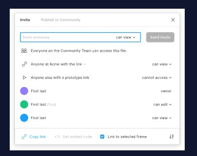
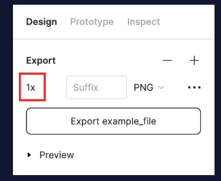
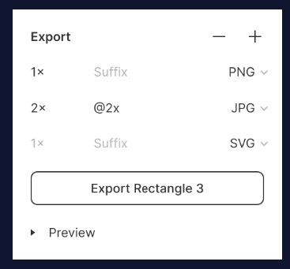
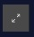
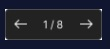

[This is the link to the lesson](https://www.codecademy.com/courses/intro-to-ui-ux/articles/ui-and-ux-sharing-and-exporting-figma)

https://www.codecademy.com/courses/intro-to-ui-ux/articles/ui-and-ux-sharing-and-exporting-figma

# Sharing and Exporting Figma Files

## Learn how to share, export, and present Figma files.

**Table of Contents**

1. Introduction
2. Sharing
3. Exporting
4. Presenting
5. Review

###Introduction

Figma is chock full of technical features that allow you to create low-fidelity concepts, high-fidelity interactive prototypes, and everything in between. Figma also boasts many features for sharing, exporting, and presenting your files. Let’s discover how we can share our designs with the world!

### Sharing
Sharing designs is helpful when you want to invite collaborators in Figma. To begin sharing your designs with others, select the “Share” button located in the top right corner of the toolbar, and the following window will appear:

In Figma, there are three primary methods of sharing resources: invitation, link sharing, and embed code.
- Invitation: Figma allows you to send email invitations to collaborators by entering the recipients’ email addresses.
- Link sharing: You can direct collaborators straight to the Figma resource with the link you can obtain by clicking on the “Copy link” button located at the bottom left corner of the pop-up window.
- Embed code: You can get the embed code by clicking on the “Get embed code” button located at the bottom center of the pop-up window. You can use this code to put the Figma file directly into a website. There are also several product [integrations](https://www.figma.com/product-integrations/) that Figma offers.

For each method of sharing, you are able to determine whether the people you are sharing with have viewing or editing privileges.

For additional information, check out [Figma’s guide to sharing and permissions](https://help.figma.com/hc/en-us/articles/1500007609322-Guide-to-sharing-and-permissions#access).

### Exporting

Exporting your designs is helpful when you want to use your work outside of Figma. In Figma, you can customize what you want to export, and how to export it. The most basic way to do this is by clicking the Figma icon and selecting “Export” or “Export frames to PDF”.

To export your designs with more specificity, select the object(s) you wish to export. Then select “Export” in the Design tab of the Properties panel.

From here, you have several export settings. On the left side of the panel, there is an adjustable _resolution multiplier_ that allows you to increase or decrease the resolution of your export. The resolution multiplier is useful to export frames that are compatible with specific device resolutions.

You can further customize your exports by using the Suffix field to append a unique identifier to the object name. Appending a suffix to the object name can provide another layer of detail when creating file names.

Figma allows you to export in four file formats: PNG, JPG, SVG, and PDF.

To meet different resolution and/or file format needs, Figma allows you to have multiple file exports of the same design using different settings. You can generate multiple exports of the same object simultaneously by selecting the "+" icon. From here, you can tune the export setting to your liking, exporting layers in different file formats and resolutions.

### Presenting

The presentation view in Figma is especially helpful when interacting with a prototype. Presentation view allows you to:

View static designs
- Present slides
- Test interactions and animations
- Perform usability tests
To open the presentation view, select the present button, which is depicted as a “play” icon, located on the top right side of the toolbar. This will open the presentation view in a new browser tab.

From the presentation view, you can:

- Add comments to the prototype by selecting The Comment button, depicted as a text bubble, located on the top left side of the toolbar in presentation view.
- Enter full-screen by selecting The Full-screen button, depicted as diagonally opposing arrows, located on the top right side of the toolbar in presentation view.
- Navigate between screens using the left and right arrow keys or by using the navigation tool The navigation tool features a back arrow, page indicator, and forward arrow. This tool is centered at the bottom of the screen in presentation mode.

For more information on presentation view, check out [Figma’s guide to present your designs](https://help.figma.com/hc/en-us/articles/360040318013-Present-designs-and-prototypes).

